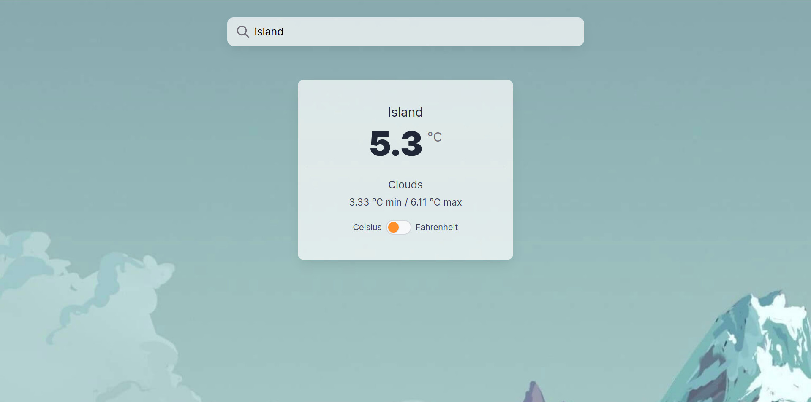
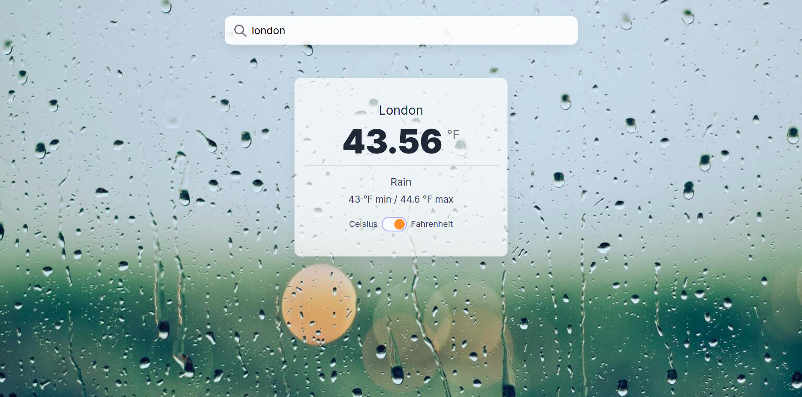
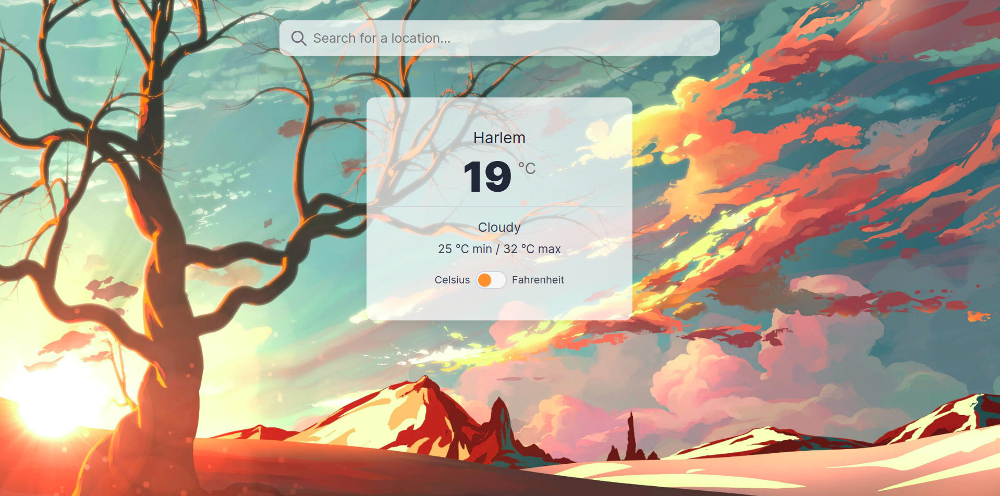

# Weather app

> See live weather reports from all around the world.

## Cloudy status

## Rain status

## Clear status

## Features

- Search by city name
- Display temperature, min temperature, max temperature
- Display city's current weather status. Eg: clear, cloudy, rainy, etc
- Change the background of the app dynamically according to the city's current
  weather status
- Toggle temperature unit between Celsius and Fahrenheit (the state is persistent)

## Built with

- Javascript
- Webpack
- HTML
- Sass

## Getting started

- Clone the repo: `https://github.com/abeidahmed/weather-app-js.git`
- `cd` into the project directory
- Run `git pull origin feature-weather-app`
- Run `npm install`
- Run `npm run dev` to start the webpack server
- Visit `localhost:3000`

## Author

### Abeid Ahmed

- GitHub: [abeidahmed](https://github.com/abeidahmed)
- Twitter: [iamhawaabi](https://twitter.com/iamhawaabi)
- LinkedIn: [Abeid Ahmed](https://www.linkedin.com/in/abeidahmed)

## Contribution

- Clone the repo using the above instructions
- Create a new branch: `git checkout -b awesome-branch`
- Add your changes and commit the file
- Push to your forked repo
- Make a pull request to `development` branch

## Show your support

Give a ⭐️ if you like

## License

This project is MIT licensed.

